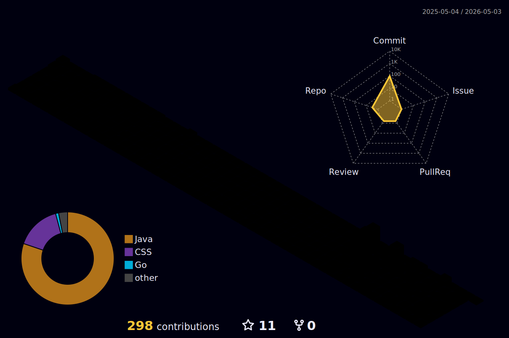

  

  <h1>👋 Hello, I'm YoungJun Park</h1>
  
<b>Cloud Native & Platform Engineer</b>

  
  <a href="https://syyjbhjh3.github.io">🔗 Portfolio & Blog</a>

   

   <h3>🛠 Tech Stack</h3>

  
<b>Cloud Native & DevOps</b>

  

    
    
    
    
     
    
    
    
    
     
    
    
  

  
<b>Backend & Frontend</b>

  

    
    
    
    
     
    
    
    
  

     

  <h3>🎓 Certifications</h3>
  

     
     
    
  

   

  
   
    

