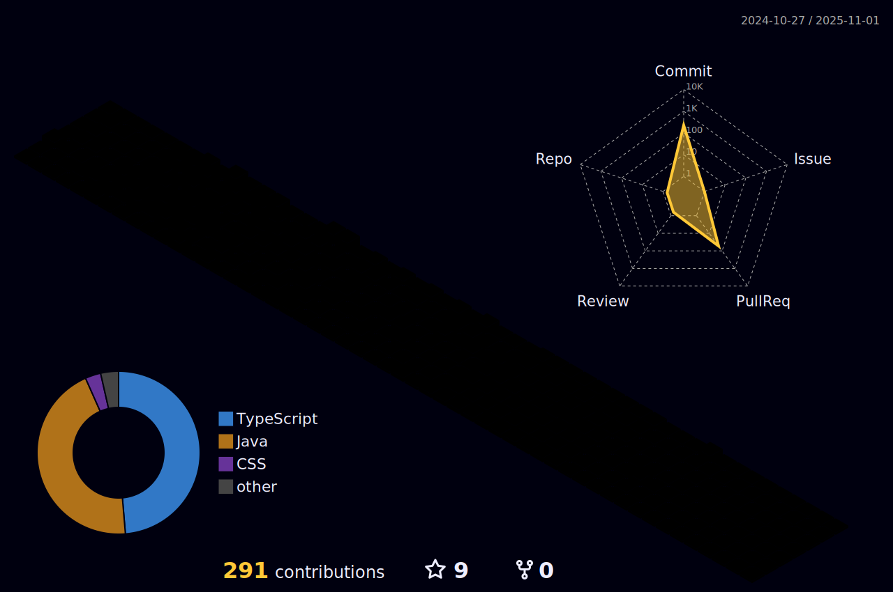

<h3 align="center">🛠 Tech Stack 🛠</h3>

 Techs that I've used at least once 

  </a>&nbsp 
  </a>&nbsp 
  </a>&nbsp 
  </a>&nbsp 
  </a>&nbsp 
   
  </a>&nbsp 
  </a>&nbsp 
  </a>&nbsp 
  </a>&nbsp 
  </a>&nbsp 
   
  </a>&nbsp 
  </a>&nbsp 
  </a>&nbsp 

 

  

<!---->

